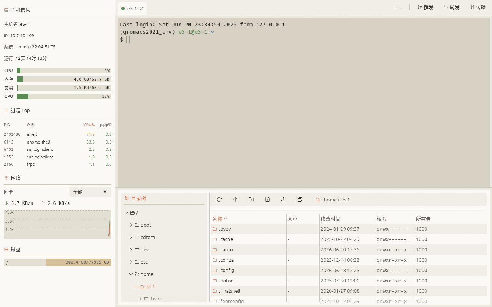

<div align="center">


**A modern, cross-platform SSH client written in Rust**

System monitor · interactive terminal · SFTP file manager · port forwarding · jump hosts — all in one window

**English** · [中文](README.zh-CN.md)

[](https://github.com/wqkx/ishell/releases)




</div>

## Why iShell

Everything you need for daily SSH work in **one window** — and it stays out of your way.

- ⚡ **Fast & lightweight** — pure Rust + GPU immediate-mode UI. A single binary (~8–12 MB), instant startup, **~0% idle CPU**, **~80 MB RAM**. No Electron / JVM / Python, no daemon, no runtime deps.
- 🎯 **Refined user experience** — a clean, warm light theme; smooth drag-to-reorder tabs; no toolbar clutter; English / 中文 switchable on the fly; sensible defaults so it just works.
- 📁 **Effortless file operations** — multi-select rubber-band, batch delete/download, server-side copy/move, **resumable** transfers that **auto-resume after reconnect**, and folder **compress-download** (tar.gz) for thousands of small files.
- 🔗 **Terminal ↔ files, linked** — "open this dir in terminal" from the file list, "reveal the terminal's current dir in the file list" the other way, and the working directory is **restored on reconnect** (OSC 7).
- 🧰 **Complete feature set** — agent auth & forwarding, jump hosts, port forwarding + SOCKS5, command broadcast & snippets, live CPU/GPU/net/disk/process monitoring with `kill -9`.
- ✍️ **A genuinely powerful editor** — a virtualized code editor that opens in its own window: **multi-cursor (Ctrl+D)**, syntax highlighting, find & replace, encoding/EOL auto-detect, Chinese IME, and it stays fast on huge files.

## ⚙️ Footprint

| Metric | Value |
|---|---|
| Binary | single file, no runtime deps / daemon — **Linux ~12 MB · macOS ~8–9 MB · Windows ~10 MB** (size-optimized: opt-level `s` + fat LTO + strip) |
| Idle CPU | **≈ 0%** (one idle session; system info polled every 2 s) |
| Memory | **~80 MB** (idle, measured) — native app, **no Electron / JVM / Python** runtime; far below Electron-based clients that idle at hundreds of MB |

> Measured on Linux, release build, one idle session; varies slightly with GPU driver / resolution.

## 🚀 Features

**Connections & sessions**
- Multi-session tabs: status dots, **smooth drag-to-reorder animation**, overflow fade, close confirmation
- **Authentication**: password, key file, **SSH agent** (`SSH_AUTH_SOCK` / Windows OpenSSH pipe), or **keyboard-interactive (OTP / 2FA)**
- **Agent forwarding (`-A`)**: let remote processes reuse your local ssh-agent keys (no re-auth across hops)
- **Import `~/.ssh/config`** (pick which hosts; Host / HostName / User / Port / IdentityFile / ProxyJump)
- **Groups / tags / search** for saved connections
- Saved-password key stored in the **OS keychain** (Secret Service / Keychain / Credential Manager), with an encrypted-file fallback
- **Auto-reconnect** on drop (exponential backoff) + manual reconnect; **restores working dir** (OSC 7) on reconnect
- **Host-key verification** (known_hosts + trust-on-first-use, anti-MITM)

**Terminal**
- vt100 / 256-color, scrollback, Tab completion, focus locking
- **Selection copy / right-click copy & paste / Ctrl+Shift+C·V**, **Ctrl+scroll to resize font**
- **Clickable URLs**, **ERROR/WARN keyword highlighting**, **session logging** to file
- **Content search** (Ctrl+Shift+F, full scrollback, match highlighting)
- **Prefix + Up/Down** per-session history search
- Dark / light terminal toggle; full CJK / IME input

**Terminal ↔ files integration**
- **File list → terminal**: right-click a folder → "Open in terminal" (or "Open current dir in terminal") `cd`s that session there
- **Terminal → file list**: right-click the terminal → "Show current dir in the file list" jumps the SFTP panel to the shell's current directory (via OSC 7, with a one-time consent prompt if the shell doesn't emit it)
- **Working dir restored on reconnect**, so a dropped session comes back where you left it

**Tunneling & batch**
- **Port forwarding**: local forward + dynamic SOCKS5 proxy
- **Jump host / ProxyJump**: reach internal targets through a bastion
- **Command broadcast**: send a command to every connected session at once
- **Command snippets**: save frequent commands, send to the current session terminal in one click (optional auto-Enter), persisted

**Files & transfers**
- SFTP: tree + list, **name filter**, **click a header to sort by name / size / time** (size & time default to descending), drag-and-drop upload, chmod / rename / copy path, optional default download folder
- **Multi-select batch ops**: Ctrl/Shift + rubber-band select; **batch delete** (Delete key / toolbar, recursive for folders), **batch download**
- **Remote copy / move**: right-click "Copy / Cut" + "Paste here", done entirely on the server (multi-select, recursive)
- **Resumable downloads**: chunk-bitmap resume bound to remote size+mtime, auto-retry on transient errors and **auto-resume after reconnect**; transfers can be cancelled or retried (no manual pause)
- **Folder compress-download**: tar.gz on the server, single-file parallel download, pure-Rust unpack — fast for many small files
- **Concurrent transfers** (up to 6 per server; independent across servers), cancellable mid-transfer
- **Lightweight image viewer** (its own OS window): double-click a `png / jpg / gif / bmp` — zoom / pan / fit / 1:1 / save-as

**Built-in code editor** (its own OS window, tabbed)
- **Unified virtualized editor** — renders only the visible lines, so even huge files open instantly and stay smooth at low memory; every file uses the same full-featured editor
- **Multi-cursor (Ctrl+D)** — accumulate selections of the same word, then **type / delete / move them all at once** (VS Code-style)
- **Syntax highlighting**, current-line highlight, **bracket matching**, indent guides, auto-close brackets
- **Find & replace** (regex / case / whole-word, match highlighting), **Go to line** (Ctrl+G), word & document navigation
- **Comment toggle**, duplicate / move / delete line, undo / redo
- **Encoding auto-detect** (UTF-8 / GBK / … via chardetng) and **EOL (LF / CRLF)** detection — both **clickable in the status bar to switch**, with safe re-encoding on save
- **External-change detection** — guards against overwriting a file edited on the server since you opened it
- Full **Chinese IME** input, double-click word select, fixed line-number gutter, download-progress tabs

**Monitoring**
- Live monitor: CPU / memory / swap, **GPU (NVIDIA / AMD / Intel)**, network graph, disks, top processes (click for details + kill -9)

## 📸 Screenshots

| SFTP file manager + concurrent transfers |
|---|
|  |

| Quick Connect | Port Forwarding |
|---|---|
|  |  |

| GPU details | Process details + kill -9 |
|---|---|
|  |  |

| Code editor — multi-cursor, syntax highlighting, find & replace, opens in its own window |
|---|
|  |

## 📦 Install

Download the binary for your platform from [**Releases**](https://github.com/wqkx/ishell/releases):

| Platform | File |
|---|---|
| Linux x86_64 | `ishell-linux-x86_64` |
| macOS Apple Silicon | `ishell-macos-aarch64` |
| macOS Intel | `ishell-macos-x86_64` |
| Windows x86_64 | `ishell-windows-x86_64.exe` |

```bash
# Linux / macOS
chmod +x ishell-*            # make it executable
./ishell-linux-x86_64
```

- **macOS** (unsigned, first run): `xattr -dr com.apple.quarantine ./ishell-macos-aarch64`, or "System Settings → Privacy & Security → Open Anyway".
- **Windows** SmartScreen: click "More info → Run anyway".

## ❓ Troubleshooting

**Chinese/IME (fcitx/ibus) won't type on Linux Wayland?**
Some Wayland desktops (KDE Plasma / GNOME) have flaky `text-input-v3` support for winit-based apps, so fcitx-style IMEs never activate or compose (same issue as Chrome/Electron). Fix: **switch to X11 (XWayland)**, where XIM input works. Two ways (either one):

- **In-app**: right-click the terminal → check "**Force X11 (fix IME · restart)**" → **restart iShell**. The setting is persisted — set it once.
- **Env var**: `ISHELL_X11=1 ./ishell-linux-x86_64` (or temporarily `WAYLAND_DISPLAY= ./ishell-linux-x86_64`).

> Trade-off: forcing X11 loses some native-Wayland niceties (e.g. smoother fractional scaling) in exchange for a working IME — the same trade-off as Chrome's `--ozone-platform=x11`. The default is still Wayland; it only switches when you enable this.

## 🔧 Build from source

Requires [Rust](https://rustup.rs/) (stable). On the target platform:

```bash
cargo run --release
```

See [BUILD.md](BUILD.md) for per-platform details, dependencies, and cross builds.

## 🏗 Architecture

- The **frontend (egui, synchronous immediate mode)** and the **backend (tokio SSH worker, async)** are decoupled via channels.
- Each session = one independent worker task: an interactive shell channel, an SFTP channel, and a system-info probe every 2 s.
- The terminal keeps its screen model in `vt100`; egui renders it line-by-line with per-span color, and keyboard events are encoded back as ANSI sequences.
- The code editor renders only visible lines over a virtualized scroll area, so file size barely affects memory or latency.

| Concern | Choice |
|---|---|
| GUI | `eframe` / `egui` 0.34 |
| SSH / SFTP | `russh` 0.61 (ring backend) / `russh-sftp` 2.3 |
| Terminal | `vt100` 0.16 |
| Async | `tokio` |
| Encrypted storage | `chacha20poly1305` |

## 🔒 Security

- **Host-key verification**: known_hosts is checked; an unknown host prompts you to confirm its SHA256 fingerprint (TOFU) before it is written; a changed key is rejected with a warning.
- **Saved-password encryption**: stored encrypted with ChaCha20-Poly1305; the key lives locally at `~/.config/ishell/key` (0600). This is at-rest encryption.

## 📄 License

[MIT](LICENSE) — a permissive license. Do whatever you want; just keep the copyright notice.

---

<div align="center">
Written in Rust · Linux / macOS / Windows
</div>
