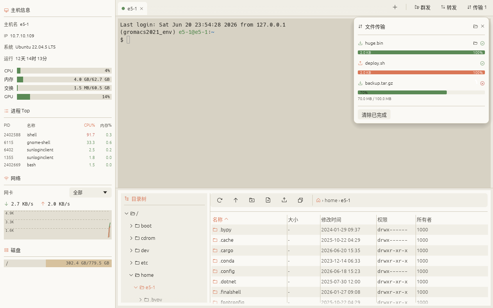
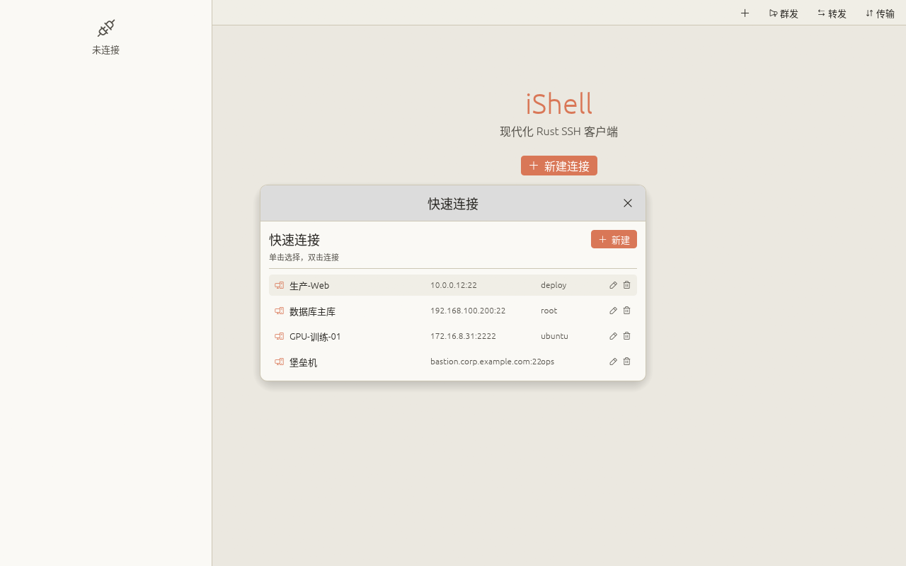
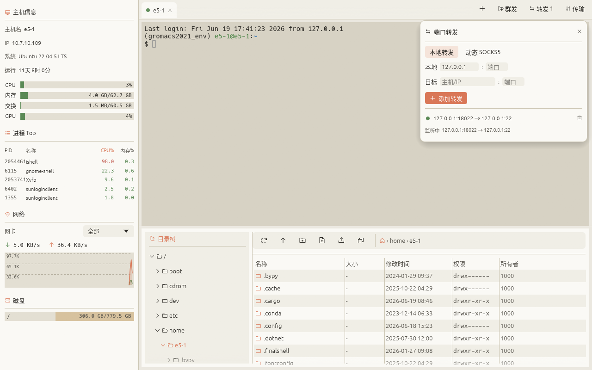
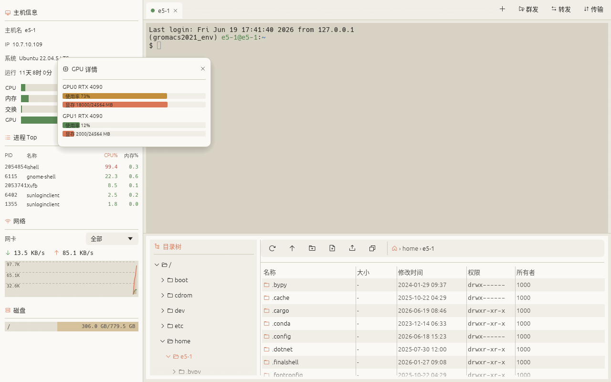
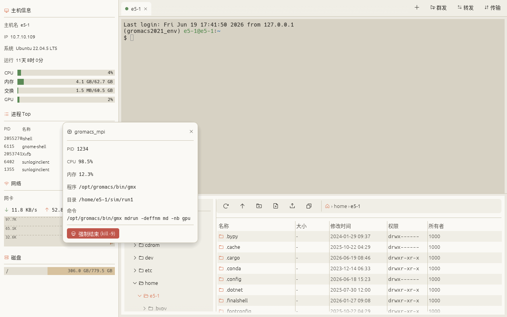
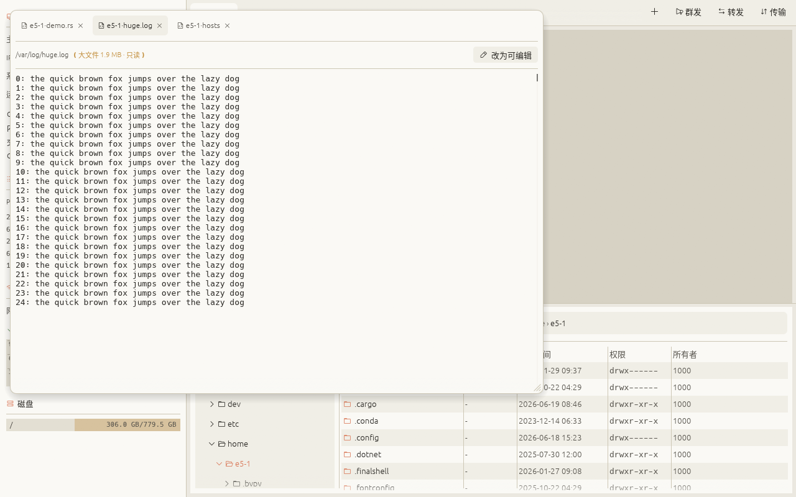

<div align="center">


**一个面向 AI 工作流的现代化终端，用 Rust 编写**

让 Claude Code、Codex CLI 等任意 MCP 兼容的 AI 助手直接驱动一个真实、持久的终端会话——外加系统监控 · SFTP 文件管理 · 端口转发 · 跳板机，一屏搞定

[English](README.md) · **中文**

[](https://github.com/wqkx/ishell/releases)


> **最新版本：** [v0.16.10](https://github.com/wqkx/ishell/releases/tag/v0.16.10)

</div>

## 为什么是 iShell

日常 SSH 运维需要的一切都在**同一个窗口**里——而且不打扰你。

- 🤖 **让 AI 直接驱动终端（MCP）** —— Claude Code、Codex CLI，以及任何兼容 MCP 的 AI 助手都可以直接操作一个真实、持久的终端会话（保留 cwd/环境/历史），而不是每次都开一条丢光上下文的 `ssh host cmd`；命令和输出实时显示在你看的到的标签里，默认关闭、按需开启。详见下文「AI / MCP 集成」一节。
- ⚡ **快、占用低** —— 纯 Rust + GPU 即时模式 UI。单文件（约 8–12 MB）、秒开、**空闲 CPU ≈ 0%**、**内存约 80 MB**。无 Electron / JVM / Python，无守护进程，无运行时依赖。
- 🎯 **用心打磨的体验** —— 干净的暖色浅色主题、标签平滑拖拽排序、不堆砌工具栏、中文 / English 随时切换、默认值合理，开箱即用。
- 📁 **便捷的文件操作** —— 框选多选、批量删除/下载、远端服务器侧复制/移动、**下载断点续传**且**断线后自动续传**、文件夹 **压缩下载**（tar.gz）应对成千上万小文件。
- 🔗 **终端 ↔ 文件 联动** —— 文件列表「在终端打开此目录」，反向「在文件列表中显示终端当前目录」，断线重连还会**恢复工作目录**（OSC 7）。
- 🧰 **功能完善** —— Agent 认证与转发、跳板机、端口转发 + SOCKS5、命令广播与片段库、CPU/GPU/网络/磁盘/进程实时监控并可 `kill -9`。
- ✍️ **真正强大的编辑器** —— 独立窗口的虚拟化代码编辑器：**多光标（Ctrl+D）**、语法高亮、查找替换、编码/换行自动识别、中文输入法，超大文件依旧流畅。

## ⚙️ 资源占用

| 指标 | 数值 |
|---|---|
| 二进制 | 单文件，无运行时依赖/守护进程 —— **Linux ~12 MB · macOS ~8–9 MB · Windows ~10 MB**（体积优化：opt-level `s` + fat LTO + strip） |
| 空闲 CPU | **≈ 0%**（单会话空闲，系统信息 2s 采集一次） |
| 内存 | **约 80 MB**（空闲，实测）——原生程序，**无 Electron / JVM / Python** 运行时，远低于 Electron 类客户端动辄数百 MB 的常驻占用 |

> 实测环境：Linux，release 构建，单会话空闲；具体随 GPU 驱动/分辨率略有差异。

## 🚀 功能

**AI / MCP 集成**（默认关闭，详见下文「AI / MCP 集成」一节）
- 让 AI 助手直接驱动一个真实终端会话——共享可见标签、命令与输出实时可见，而不是另开一条丢光上下文的 SSH 连接
- 支持 **Claude Code、Codex CLI，以及任何兼容 MCP 的客户端**——一个二进制，标准 MCP stdio 传输
- 完整工具集：执行命令并等待完成、继续等待长任务、读屏幕/历史、发送原始按键（应对交互式提示）、中断、开关会话、读写远端文件
- 通过已有 SSH 连接**自动反向转发**到远端服务器，AI 在远端也能连回来控制本机 iShell，无需额外配置

**连接与会话**
- 多会话标签：状态圆点、**平滑拖拽排序动画**、溢出渐隐、关闭确认
- **认证**：密码、私钥文件、**SSH Agent**（`SSH_AUTH_SOCK` / Windows OpenSSH 命名管道），或 **键盘交互（OTP / 2FA 二次验证）**
- **Agent 转发（`-A`）**：远端进程复用本机 ssh-agent 的私钥（多跳免再次输密）
- **导入 `~/.ssh/config`**（勾选要导入的主机；Host / HostName / User / Port / IdentityFile / ProxyJump）
- 保存连接的**分组 / 标签 / 搜索**
- 保存密码的主密钥存入**系统钥匙串**（Secret Service / Keychain / 凭据管理器），不可用时回退到加密文件
- **断线自动重连**（指数退避）+ 手动重连；重连后**恢复工作目录**（OSC 7）
- **主机密钥校验**（known_hosts + 首次信任 TOFU，防中间人）

**终端**
- vt100 / 256 色、滚轮回滚、Tab 补全、焦点锁定
- **选中复制 / 右键复制粘贴 / Ctrl+Shift+C·V**、**Ctrl+滚轮调字号**
- **URL 可点击**、**ERROR/WARN 关键字高亮**、**会话日志录制**
- **内容搜索**（Ctrl+Shift+F，全回滚缓冲，命中高亮）
- **输入前缀 + 上下键**的本会话历史检索
- 深 / 浅终端配色切换；完整中文 / 输入法支持

**终端 ↔ 文件 联动**
- **文件列表 → 终端**：右键文件夹 →「在终端打开此目录」（或「在终端打开当前目录」），让该会话 `cd` 过去
- **终端 → 文件列表**：终端区右键 →「在文件列表中显示当前目录」，把 SFTP 面板跳转到 shell 的当前目录（基于 OSC 7；若 shell 未上报则一次性确认后注入）
- **断线重连恢复工作目录**，掉线回来还在原处

**穿透与批量**
- **端口转发**：本地转发 + 动态 SOCKS5 代理
- **跳板机 / ProxyJump**：经堡垒机连接内网目标
- **命令广播**：向所有已连接会话同时发命令
- **命令片段库**：保存常用命令，一键发送到当前会话终端（可选自动回车），持久化保存

**文件与传输**
- SFTP：树形目录 + 列表、**名称过滤**、**点击表头按名称/大小/时间排序**（大小、时间首次点击为降序）、拖拽上传、改权限 / 重命名 / 复制路径、可选默认下载目录
- **多选批量操作**：Ctrl/Shift 多选 + 框选；**批量删除**（Delete 键 / 工具栏，含文件夹递归）、**批量下载**
- **远端复制 / 移动**：右键「复制 / 剪切」+「粘贴到此目录」，在远端直接完成（含多选、目录递归）
- **下载断点续传**：分块位图续传（绑定远端大小 + mtime）+ 瞬时失败自动重试、**断线重连后自动续传**；传输可取消/重试（无手动暂停）
- **文件夹压缩下载**：远端 tar.gz 打包、单文件并发下载、纯 Rust 解包——多小文件更快
- **多文件并发传输**（同一服务器最多 6 个，不同服务器互不影响）、可中途取消
- **超轻量看图工具**（独立 OS 窗口）：双击 `png / jpg / gif / bmp`——缩放/平移/适应/1:1/另存为

**内置代码编辑器**（独立 OS 窗口、多标签）
- **统一虚拟化编辑器**——只渲染可见行，超大文件秒开、低内存、滚动流畅；所有文件共用同一套全功能编辑器
- **多光标（Ctrl+D）**——累加选中相同的词，然后**同时输入 / 删除 / 移动**（VS Code 风格）
- **语法高亮**、当前行高亮、**括号匹配**、缩进参考线、自动补全括号
- **查找替换**（正则 / 大小写 / 全词，命中高亮）、**跳转到行**（Ctrl+G）、按词 / 整文跳转
- **注释切换**、复制 / 移动 / 删除整行、撤销 / 重做
- **编码自动识别**（UTF-8 / GBK / … 经 chardetng）与**换行符（LF / CRLF）**识别——二者均可**在状态栏点击切换**，保存时安全重编码
- **外部改动检测**——保存前防止覆盖「打开后又被服务器端改过」的文件
- 完整**中文输入法**、双击选词、固定行号列、下载进度标签

**监控**
- 实时监控：CPU / 内存 / 交换、**GPU（NVIDIA / AMD / Intel）**、网络曲线、磁盘、进程 Top（点击查看详情 + 强制结束）

## 📸 截图

| SFTP 文件管理 + 并发传输 |
|---|
|  |

| 快速连接 | 端口转发 |
|---|---|
|  |  |

| GPU 详情 | 进程详情 + 强制结束 |
|---|---|
|  |  |

| 代码编辑器 —— 多光标、语法高亮、查找替换、独立窗口打开 |
|---|
|  |

## 📦 安装

从 [**Releases**](https://github.com/wqkx/ishell/releases) 下载对应平台的可执行文件：

| 平台 | 文件 |
|---|---|
| Linux x86_64 | `ishell-linux-x86_64` |
| macOS Apple Silicon | `ishell-macos-aarch64` |
| macOS Intel | `ishell-macos-x86_64` |
| Windows x86_64 | `ishell-windows-x86_64.exe` |

```bash
# Linux / macOS
chmod +x ishell-*            # 赋可执行权限
./ishell-linux-x86_64
```

- **macOS** 未签名首次运行：`xattr -dr com.apple.quarantine ./ishell-macos-aarch64`，或“系统设置 → 隐私与安全性 → 仍要打开”。
- **Windows** SmartScreen：点“更多信息 → 仍要运行”。

## ❓ 常见问题

**Linux Wayland 下输入法（fcitx/ibus）打不了中文？**
部分 Wayland 桌面（如 KDE Plasma / GNOME）对 winit 类应用的 `text-input-v3` 协议支持有坑，导致 fcitx 等输入法无法激活、组字（和 Chrome/Electron 同病）。解决：**改走 X11（XWayland）**，其 XIM 输入法正常。两种开启方式（任选其一）：

- **应用内**：终端区右键 → 勾选「**强制 X11（修复输入法·重启生效）**」→ **重启 iShell**。该设置持久化，设一次即可。
- **环境变量**：`ISHELL_X11=1 ./ishell-linux-x86_64`（或临时 `WAYLAND_DISPLAY= ./ishell-linux-x86_64`）。

> 权衡：强制 X11 会损失部分原生 Wayland 体验（如分数缩放更顺滑），换来输入法可用——与 Chrome 的 `--ozone-platform=x11` 同理。默认仍走 Wayland，仅在你开启后切换。

## 🔧 从源码构建

需要 [Rust](https://rustup.rs/)（stable）。在目标平台上：

```bash
cargo run --release
```

各平台细节、依赖与交叉构建见 [BUILD.md](BUILD.md)。

## 🏗 架构

- **前台（egui，同步即时模式）** 与 **后台（tokio SSH worker，异步）** 通过 channel 解耦。
- 每个会话 = 一个独立 worker 任务：交互式 shell 通道、SFTP 通道、每 2s 一次的系统信息探测。
- 终端用 `vt100` 维护屏幕模型，egui 逐行分段着色渲染，键盘事件编码为 ANSI 序列回写。
- 代码编辑器在虚拟化滚动区上只渲染可见行，大文件滚动流畅、延迟低；内存随文件大小线性增长（正文常驻内存）。

| 关注点 | 选型 |
|---|---|
| GUI | `eframe` / `egui` 0.34 |
| SSH / SFTP | `russh` 0.61（ring 后端） / `russh-sftp` 2.3 |
| 终端 | `vt100` 0.16 |
| 异步 | `tokio` |
| 加密存储 | `chacha20poly1305` |

## 🤖 AI / MCP 集成

让 AI 助手（Claude Code、Codex CLI，或任何其它兼容 MCP 的智能体）直接驱动一个真实的终端会话——而不是每次都另开一条丢光 cwd/环境/
历史的 `ssh host cmd`。既可以接管你已经打开的标签，也可以让 AI 用一个已保存的连接自己新开一个
（只读，仅供 AI 操作，人不能往里打字），两种会话在标签栏都会有醒目的 🤖 标识。

- **默认关闭**。在右键设置菜单里打开"允许 AI 通过 MCP 控制终端"（需重启生效）。只监听本地
  Unix domain socket（每个 iShell 进程各一份 `~/.config/ishell/mcp-<pid>.sock`，权限 `0600`），
  不监听任何网络端口。
- **共享可见终端**。AI 执行的命令和产生的输出会实时显示在对应终端标签里，效果等同于人亲自输入。
- **接入方式**：编译一次配套的独立二进制（`cargo build --release --bin ishell-mcp`），再安装到
  标准位置。在**运行 AI 客户端的那台机器**上执行：
  ```bash
  scripts/install-mcp.sh target/release/ishell-mcp
  ```
  它会把二进制拷到 **`~/.ishell-mcp/bin/ishell-mcp`**（稳定、自命名空间的路径，不随仓库位置/
  重建变化）并打印注册命令。二进制走标准 MCP stdio 传输，不绑定任何客户端——把下面任一客户端
  指向这个路径即可：
  - **Claude Code** —— 直接注册为全局可用（不限于某个项目目录）：
    ```bash
    claude mcp add ishell -s user -- ~/.ishell-mcp/bin/ishell-mcp
    ```
  - **Codex CLI** —— 用法类似：
    ```bash
    codex mcp add ishell -- ~/.ishell-mcp/bin/ishell-mcp
    ```
    （或手动加到 `~/.codex/config.toml`：`[mcp_servers.ishell]` / `command = "~/.ishell-mcp/bin/ishell-mcp"`——
    如果 CLI/配置格式有变化，以 `codex mcp --help` 为准）
  - **其它兼容 MCP 的客户端**（Cursor、Windsurf、Cline……）—— 大多接受通用写法：
    ```json
    { "mcpServers": { "ishell": { "command": "~/.ishell-mcp/bin/ishell-mcp" } } }
    ```
  - **两者要同版本**：GUI 与 `ishell-mcp` 的线协议是编译在一起的，必须同一版本。升级 iShell 后
    重跑 `install-mcp.sh` 覆盖代理即可；若忘了升级代理，它会在连接时以「版本不一致，请重新
    部署」明确报错，而不是静默出错。（`ishell-mcp --version` 会打印其 crate 与协议版本。）
- **暴露的工具**：
  - `list_sessions` / `list_saved_connections`：列出当前打开的会话 / 所有已保存的连接配置；
  - `open_session`：用一个已保存的连接新开一个只读会话供 AI 专用；首次使用某条连接会弹窗让你
    当面确认，之后同一进程生命周期内不再重复确认；
  - `close_session`：关闭一个 AI 自己开的会话（不能关用户自己的会话）；
  - `run_command`：执行一条命令并等待完成或超时，返回输出 + 退出码；`poll_run` 对超时未完成的
    命令继续等待、不重发；长任务直接传一个够大的 `timeout_ms`（最长 24 小时）即可，不需要
    `sleep` 轮询；
  - `start_command`：立即启动长任务，至多等待 100ms 后返回 `run_id`；受 MCP 客户端空闲超时
    限制时，用它配合短时 `poll_run` 查询，避免遗留等待者。
  - `send_input`：向交互式提示（`sudo` 密码、`vim`/REPL 里继续输入）直接发送原始按键，跳过
    完成检测；
  - `read_screen`：类似 `tmux capture-pane`，导出当前可见屏幕纯文本，适合看 `vim`/`top` 这类
    交互式程序；`read_history` 读取该会话从开始至今的完整回滚历史（不止一屏）；
  - `interrupt`：发送 Ctrl+C；同时也是并发保护的退出口——一个会话同一时刻只允许一条挂起的
    AI 命令，卡住时调用一次 `interrupt` 即可立即释放（代价是丢失那条命令的结果）；
  - `write_file` / `read_file`：复用已有 SFTP 连接读写远端文本文件，**内容内联在请求/响应里**——
    小文件很方便，但整份内容都要经过这条 JSON-RPC 连接；
  - `copy_to_remote`：从运行 `ishell-mcp` 的**调用方机器**流式读取单个文件，经 iShell 已有的
    SFTP 会话上传到远端；文件字节不经过 MCP JSON，也不进入模型上下文。适合跨主机同步大源码和
    二进制文件，替代 `write_file`。当前目录同步请使用 git/rsync 或逐文件调用。
  - `copy_from_remote`：复用同一条 SFTP 连接下载到 **iShell 宿主机**；跨主机回传到 MCP 调用方
    的流式数据通道尚未提供，不能把调用方路径当作 iShell 宿主机路径。
- **远程访问，自动完成**。开关打开后，iShell 每次连上一台服务器，都会顺便把本机的 MCP socket
  经这条已认证加密的 SSH 连接反向转发到**那台服务器**上的 `~/.ishell-mcp-<随机后缀>.sock`
  （每次连接的后缀都不同，重连时不会跟服务器还没判定为死亡的上一条连接抢同一个路径）——
  不额外开监听端口，也不需要单独管理一套凭据。谁能 SSH 到那台服务器，谁就能通过转发出来的
  socket 控制这边的 iShell，所以只对你真正信任的服务器开启这个开关。`ishell-mcp` 自己会动态
  探测当前有效的转发 socket（每次调用都重新找一遍最新可连接的 `mcp-*.sock`/`~/.ishell-mcp-*.sock`），
  不需要配置路径，iShell 重连后也不用重连 MCP client：
  ```bash
  /path/to/ishell-mcp
  ```
- **手动方式**：不依赖上面的自动反向转发，自己用 SSH 转发（socket 名按实际 pid 替换）：
  ```bash
  ssh -N -L /tmp/ishell-mcp.sock:$HOME/.config/ishell/mcp-<pid>.sock user@ishell-host &
  ISHELL_MCP_SOCKET=/tmp/ishell-mcp.sock /path/to/ishell-mcp
  ```

## 🔒 安全

- **主机密钥校验**：known_hosts 校验，未知主机首次连接弹窗确认 SHA256 指纹（TOFU）并写入；密钥改变则拒绝告警。
- **保存密码加密**：以 ChaCha20-Poly1305 加密落盘，密钥存于本地 `~/.config/ishell/key`（0600）；属 at-rest 加密。

## 📄 许可证

[MIT](LICENSE) —— 宽松许可证。随意使用/修改/分发/商用，保留版权声明即可。

---

<div align="center">
用 Rust 编写 · Linux / macOS / Windows
</div>
